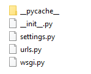

# Python Django Project
* Django Organizes a single website as a project
* Below are the steps to Create and Run a New Django Project


## STEP 1. Create Project Folder
* Create a New Folder on your computer
* In this case we are using Windows OS and create a folder in 
  `F:\DjangoLabs\training` using the command:
```
mkdir F:\DjangoLabs\training
```


## STEP 2. Create Django Project
* At the in the Target Project folder in this case `F:\DjangoLabs\training` 
  Command Prompt and run the following to create a new django project.
```
django-admin startproject tinitiate
```
* In the `tinitate` folder we see 2 Files and a new `tinitate` folder, Files/Folder created;
    * db.sqlite3
    * manage.py
      * The manage.py script is used to create applications, start the 
        development web server.
    * /tinitiate [Folder]
        * The following folder structure would be seen in the `tinitiate\tinitiate` folder
        
        * The file details:
          * **__init__.py**
          * **settings.py**
            * settings.py contains all the settings for the website. Such as applications 
              (parts of the website), the static file locations, database connection details etc..
          * **urls.py**
            * urls.py defines the site url to views.py mappings from various APPs.
          * **wsgi.py**
            * wsgi.py enables the Django application to communicate with the web server.


## STEP 3. Start the Project
* open project folder `tinitiate`, locate `manage.py` and in command 
  line run the following.
```
python manage.py runserver
```
* Now open a browser and type localhost:8000 in the address bar to see the 
  default home webpage.
