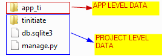
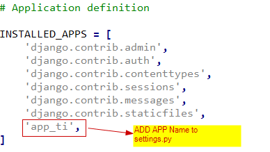
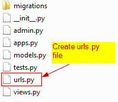

# Django APPs
* In Django every **PROJECT** is made up of **APPs**,  They are the independent 
  control mechanisms to handle pages and sub folders of the web project.


## STEP 1. Create Django APP
* Navigate to the Project Folder and in the path that has the `manage.py` file
* Create an **APP** named `app_ti`
* Using the following command.
```
python manage.py startapp app_ti
```
* This will create a folder `app_ti`
* Folder structure inside the Project folder `tinitiate folder` level

>
* Folder structure inside the App folder `app_ti` folder` level

>

## STEP 2. Add APP details to Project settings.py file
* Locate the **PROJECTs** `settings.py` file, In this case its located in the 
  `tinitiate/tinitiate/settings.py` file, Append the **APP** name `app_ti` to 
  the list **INSTALLED_APPS**



## STEP 3. Add APP to the PROJECT urls.py file
* The Path to the URL from ROOT URL **localhost** or **www.MY-DOMAIN.COM** 
  is the APP Folder, That can be specified in the `urls.py`
* In the Project folder `tinitiate` locate the `urls.py`
* Add the following code
```python
from django.contrib import admin
from django.urls import include, path

urlpatterns = [
    path('app_ti', include('app_ti.urls')),
    path('admin/', admin.site.urls),
]
```

## STEP 4. Add content to the APPs views.py file
* Django supports the **Model View Template (MVT)** pattern of web pages
  * The MVT is defined as the **Model** The data (Usually from a DataBase or 
    User Input) that needs to be displayed in the web page.
    * **VIEWS**
    * The VIEW is the webpage itself, Here the HttpResponse renders to the HTML.
    * Here we demonstrate A simple view creates a Text Response, `app_home`
* In the `app_ti` folder locate the `views.py` file and add the following
```python
from django.http import HttpResponse

def app_home(request):
    return HttpResponse("Welcome to Tinitiate Django app_ti Home Page")
```


## STEP 5. APP folder urls.py Configuration
* Create an new file `urls.py` in the APP `app_ti` folder

* Add the following code
```python
from django.urls import path
from . import views

urlpatterns = [
    # For URL: localhost:8000 and view function: app_home
    path('', views.app_home, name='app_home'),
]
```

### Understanding the routing views.py and urls.py
* In the `views.py` we created functions to handle different URLs
* The `return HttpResponse` in the functions accepts a string and returns 
  HTML, which is browser readable.
* In the `urls.py` the URL pattern is associated to the view.<function-name>


## STEP 6. Run Project and Test URLS in Browser
* At commandline start the project, using the command:
```
python manage.py runserver
```
* Open a browser to test the URLs defined so far
* localhost:8000/app_ti/app_home/
* This will display the Apps' `view` `app_home` defined in the function **app_home**
