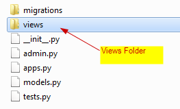
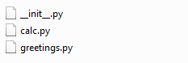

# Splitting Django Views In multiple files
* For easy managability and scalability, Django enables users to split the 
  views.py into multiple files.
* This involves creating a **views** folder, and creating multiple code files 
  with functions returning HttpResponse Oject to render HTML.


## STEP 1. Create Django APP To Demonstrate Mulitple View Files
* Navigate to the Project Folder `tinitiate` and in the path that has the 
  `manage.py` file.
* Create an **APP** named `app_multiple_view_files`
* Using the following command.
```
python manage.py startapp app_multiple_view_files
```
>

## STEP 2. Add APP details to Project settings.py file
* Locate the **PROJECTs** `settings.py` file, In this case its located in the 
  `tinitiate/tinitiate/settings.py` file, Append the **APP NAME app_multiple_view_files**
  name to the list **INSTALLED_APPS**
>

## STEP 3. Create the VIEWS FOLDER
* To have mulitple view files, we need to create a folder named `views` folder
* This folder will require the `__init__.py` and view files
* The `__init__.py` has the imports from the view files (they can have any names)
  ,These are named as `calc.py` and `greetings.py`

* Folder Structure of the View folder

>
>
* __init__.py File Code
```python
from .calc import *
from .greetings import *
```
>
* `calc.py` File Code
```python
from django.shortcuts import render
from django.http import HttpResponse

def num_square(request, in_number):

    response = "Square of " + str(in_number) + " is: " + str(pow(in_number,2))
    return HttpResponse(response)


def even_or_odd(request, in_number):

    s_data = str(in_number)
    if (in_number%2) == 0:
        response = s_data + " is a even number"
    else:
        response = s_data + " is a odd number"

    return HttpResponse(response)
```
>
* `greetings.py` File Code
```python
from django.shortcuts import render
from django.http import HttpResponse

def hello(request, in_data):
    response = "Hello: " + str(in_data)
    return HttpResponse(response)

def bday(request, in_data):
    response = "Happy Birthday: " + str(in_data)
    return HttpResponse(response)
```
>

## STEP 4. APP folder urls.py Configuration
* Create an new file `urls.py` in the APP folder
* Add the following code
* The APP Folders `urls.py` imports the view files from the `views` folder
  * `from .views import greetings`
  * `from .views import calc`
```python
from django.conf.urls import url
from django.urls import path
from .views import greetings
from .views import calc

urlpatterns = [
    # For URL: localhost:8000/multiple_views/hello and view function: hello
    # Usage Example URL: localhost:8000/multiple_views/hello/tinitiate
    path('hello/<str:in_data>', greetings.hello, name='hello'),

    # For URL: localhost:8000/multiple_views/bday and view function: bday
    # Usage Example URL: localhost:8000/multiple_views/bday/tinitiate
    path('bday/<str:in_data>', greetings.bday, name='bday'),
    
    # For URL: localhost:8000/multiple_views/num_square and view function: num_square
    # Usage Example URL: localhost:8000/multiple_views/num_square/3
    path('num_square/<int:in_number>', calc.num_square, name='num_square'),

    # For URL: localhost:8000/multiple_views/even_or_odd and view function: even_or_odd
    # Usage Example URL: localhost:8000/multiple_views/even_or_odd/1
    path('even_or_odd/<int:in_number>', calc.even_or_odd, name='even_or_odd'),
]
```
>

## STEP 5. Add APP to the PROJECT urls.py file
* Create an empty file `urls.py`
* Add the following code
```python
from django.contrib import admin
from django.urls import include, path

urlpatterns = [
    path('multiple_views/', include('app_multiple_view_files.urls')),
    path('app_views/', include('app_views.urls')),
    path('app_ti/', include('app_ti.urls')),
    path('admin/', admin.site.urls),
]
```

### Understanding the routing views.py and urls.py
* In the `views.py` we created functions to handle different URLs
* The `return HttpResponse` in the functions accepts a string and returns 
  HTML, which is browser readable.
* In the `urls.py` the URL pattern is associated to the view.<function-name>
>

## STEP 6. Run Project and Test URLS in Browser
* At commandline start the project, using the command:
```
python manage.py runserver
```
* Open a browser to test the URLs defined so far
 * localhost:8000/multiple_views/num_square/2
 * localhost:8000/multiple_views/num_square/2
 * localhost:8000/multiple_views/hello/tinitiate
 * localhost:8000/multiple_views/bday/tinitiate
