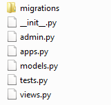

# Django Response Types of Views
* The VIEW is the webpage itself ina Django project, Its a Web response 
  Retun object of a python function 
* The web response (HttpResponse Oject) renders to the HTML.
* Below is a demonstration of different response types of views.
  * HttpResponse / content_type
  * StreamingHttpResponse
  * JsonResponse

## STEP 1. Create Django APP To Demonstrate Views Response Types
* Navigate to the Project Folder `tinitiate` and in the path that has the 
  `manage.py` file.
* Create an **APP** named `app_response_types`
* Using the following command.
```
python manage.py startapp app_response_types
```

## STEP 2. Check APP Folder and Files
* Locate the **PROJECTs** `settings.py` file, In this case its located in the 
  `tinitiate/tinitiate/settings.py` file, Append the **APP** names to the 
  list **INSTALLED_APPS**  we created in **STEP 3**


## STEP 3. Create views.py file with different Response Types
* Here we create a `views.py` file with various methods demonstrating 
  various Response Types.
* Here we demonstrate 
  * View with 
  * View with 
  * View with 
  * View with   
```
from django.shortcuts import render
from django.http import HttpResponse, FileResponse, JsonResponse, StreamingHttpResponse
import csv
import requests
from PIL import Image
from io import BytesIO

def http_response_plain_text(request):
    return HttpResponse("Plain Text Response", content_type="text/plain")

def http_response_xml_text(request):
    response = """<?xml version="1.0" encoding="UTF-8"?>
                  <data>
                      <topic>Python Django</topic>
                      <heading>Response Types</heading>
                  </data>"""

    return HttpResponse(response, content_type="text/xml")

def http_response_html(request):

    html_text = """<h1>HTML Response </h1>
                <p style="background-color:red; color:white;">HTML Response Output</p>"""

    return HttpResponse(html_text)

def json_response(request):
    return JsonResponse({'data':'tinitiate'})

"""
def file_response(request):
    _file = 'https://www.python.org/static/community_logos/python-logo-master-v3-TM.png'
    response = requests.get(_file)
    img = Image.open(BytesIO(response.content))
    response = FileResponse(img)
    response['Content-Disposition'] = "attachment; filename=%s" % image.svg
    return response
"""

######################################################################
## STREAMING EXAMPLE 
## This will download a file with 1 to 100 each number on a new line
######################################################################
def generator():
    for x in range(100):
        yield str(x) + "\n"

def streaming_http_response(queryset):
    response = StreamingHttpResponse( streaming_content=generator(),content_type='text/plain')

    response['Content-Disposition'] = 'attachment;filename=data.txt'
    return response
```

## STEP 4. APP folder urls.py Configuration
* Create an new file `urls.py` in the APP folder
* Add the following code
```
from django.urls import path
from . import views

urlpatterns = [
    path('plain_text/', views.http_response_plain_text, name='http_response_plain_text'),
    path('xml_text/', views.http_response_xml_text, name='http_response_xml_text'),
    path('json_response/', views.json_response, name='json_response'),
    path('html_response/', views.http_response_html, name='http_response_html'),
    path('streaming/', views.streaming_http_response, name='streaming_http_response'),
    path('file_response/', views.file_response, name='file_response'),
]
```

## STEP 5. PROJECT folder urls.py Configuration
* Create an empty file `urls.py`
* Add the following code
```
from django.contrib import admin
from django.urls import include, path

urlpatterns = [
    path('', include('app_home.urls')),
    path('app_urls/', include('app_urls.urls')),
    path('app_django_templates_inheritance/', include('app_django_templates_inheritance.urls')),
    path('app_django_html_templates/', include('app_django_html_templates.urls')),
    path('multiple_views/', include('app_multiple_view_files.urls')),
    path('app_views/', include('app_views.urls')),
    path('app_ti/', include('app_ti.urls')),
    path('app_response_types/', include('app_response_types.urls')),
    path('admin/', admin.site.urls),
]
```

### Understanding the routing views.py and urls.py
* In the `views.py` we created functions to handle different URLs
* The `return HttpResponse` in the functions accepts a string and returns 
  HTML, which is browser readable.
* In the `urls.py` the URL pattern is associated to the view.<function-name>


## STEP 6. Run Project and Test URLS in Browser
* At commandline start the project, using the command:
```
python manage.py runserver
```
* Open a browser to test the URLs defined so far
  * localhost:8000/app_response_types/plain_text
  * localhost:8000/app_response_types/xml_text
  * localhost:8000/app_response_types/json_response
  * localhost:8000/app_response_types/html_response
  * localhost:8000/app_response_types/streaming
  * localhost:8000/app_response_types/file_response [Under Development]