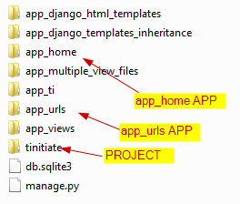

# Django URLs
* URLs or **Uniform Resource Locator** is the WebAddress, Thesse are the endpoints 
  with which the user accesses the functions from **views.py**.
* Demonstration of URLs mapping to **view.py** function by the following:
  * **Home Page or Root Page**
  * **By URL Name**
  * **By URL Pattern**
* Folder Structure


## Django Home Page or Root Page

### STEP 1. Create Django APP To Demonstrate Home Page
* Navigate to the Project Folder `tinitiate` and in the path that has the 
  `manage.py` file.
* Create an **APP** named `app_home`
* Using the following command.
```
python manage.py startapp app_home
```

### STEP 2. Add APP details to Project settings.py file
* Locate the **PROJECTs** `settings.py` file, In this case its located in the 
  `tinitiate/tinitiate/settings.py` file, Append the **APP NAME app_home**
  names to the list **INSTALLED_APPS**

### STEP 3. views.py file
* Here we demonstrate URL patterns
```
from django.shortcuts import render
from django.http import HttpResponse

def home(request):
    return HttpResponse("Welcome to Tinitiate Django Home Page from the APP: app_home !!")

```

### STEP 4. Add APP to the PROJECT urls.py file
* Create an new file `urls.py` in the APP folder
* Add the following code
```
from django.conf.urls import url
from django.urls import path
from . import views

urlpatterns = [
    # For URL: localhost:8000/ and view function: home
    # Usage Example URL: localhost:8000
    path('', views.home, name='home'),
]
```


## Django URL Pattern and Name

### STEP 1. Create Django APP To Demonstrate URL Patterns and Page by Name
* Navigate to the Project Folder `tinitiate` and in the path that has the 
  `manage.py` file.
* Create an **APP** named `app_urls`
* Using the following command.
```
python manage.py startapp app_urls
```

### STEP 2. Add APP details to Project settings.py file
* Locate the **PROJECTs** `settings.py` file, In this case its located in the 
  `tinitiate/tinitiate/settings.py` file, Append the **APP NAME app_urls**
  names to the list **INSTALLED_APPS**
  
### STEP 3. views.py file
* Here we demonstrate URL patterns
```
from django.shortcuts import render
from django.http import HttpResponse

def message(request):
    return HttpResponse("Welcome to Tinitiate Django message page")

def year_month(request, in_year, in_month):
    response = "Input Year: " + str(in_year) + " Input Month: " + str(in_month)
    return HttpResponse(response)

def slug_test(request, in_slug):
    response = "Input Slug: " + in_slug
    return HttpResponse(response)
```

### STEP 4. Add APP to the PROJECT urls.py file
* Create an new file `urls.py` in the APP folder
* The following demonstrates
  * **PATH** Standard URL Paths with and without parameters.
  * **RE_PATH** URL Paths which support Regular Expressions, with and without 
    parameters.
  * **Include** Include URLs from other APPs, in this case the **APP_HOME**
    in the current APP **APP_URLS**.
```
from django.conf.urls import include, url
from django.urls import path, re_path

from . import views
# import app_views #import urls as app_views_urls

urlpatterns = [
    # Path
    path('message/', views.message, name='message'),
    path('slug_test/<slug:in_slug>/', views.slug_test),

    # RegEx Path    
    re_path(r'^year_month/(?P<in_year>[0-9]{4})/(?P<in_month>[0-9]{2})/$', views.year_month),
    
    # Include
    url('include_test/', include('app_views.urls')),
]
```
>

## Common Steps for both the above demonstration
### COMMON STEP 1. PROJECT folder urls.py Configuration
* The Pattern for path `path('^$', include('app_home.urls')),`, Indicates this 
  is the Root page or the Home Page.
* Add the following code
```
from django.contrib import admin
from django.urls import include, path

urlpatterns = [
    # HOME PAGE
    path('^$', include('app_home.urls')),
    path('app_urls/', include('app_urls.urls')),
    path('app_django_templates_inheritance/', include('app_django_templates_inheritance.urls')),
    path('app_django_html_templates/', include('app_django_html_templates.urls')),
    path('multiple_views/', include('app_multiple_view_files.urls')),
    path('app_views/', include('app_views.urls')),
    path('app_ti/', include('app_ti.urls')),
    path('admin/', admin.site.urls),
]
```

### Understanding the routing views.py and urls.py
* In the `views.py` we created functions to handle different URLs
* The `return HttpResponse` in the functions accepts a string and returns 
  HTML, which is browser readable.
* In the `urls.py` the URL pattern is associated to the view.<function-name>
>

## STEP 6. Run Project and Test URLS in Browser
* At commandline start the project, using the command:
```
python manage.py runserver
```
* **TESTING**
* Open a browser to test the URLs defined so far
  * For Home Page Use: `localhost:8000/`
  * For Regular Expressions parameters Page Use: `localhost:8000/app_urls/year_month/2002/11/`
  * For Include URLs from other apps Use: `localhost:8000/app_urls/include_test/view_no_param/`
