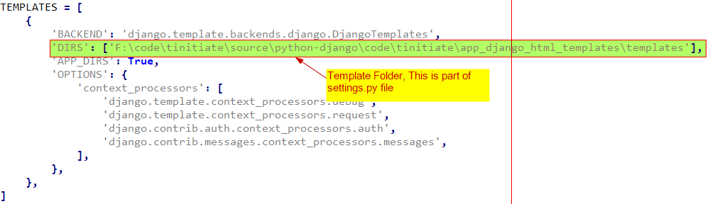

# Django Templates
* Django supports Templates,
* A template is a text file, that can be structured around a specific HTML, 
  CSV, XML.. file,
* Templates support variables, code blocks[functions], conditional statements, 
  loops and filters (can be equated to builtin functions).
* Template is a convenient way to generate HTML dynamically. 
* Since most elements of a give set of releated HTML pages is common,
  template contains the static parts of the desired HTML, with substitutable 
  variables.

## Demonstration for Django HTML Templates

## STEP 1. Create Django APP To Demonstrate Django HTML Templates
* Navigate to the Project Folder `tinitiate` and in the path that has the 
  `manage.py` file.
* Create an **APP** named `app_django_html_templates`
* Using the following command.
```
python manage.py startapp app_django_html_templates
```

### STEP 2. Add APP details to Project settings.py file
* Add Template Directory to `TEMPLATES` Dictionary in the projects `settings.py`
  `'DIRS': ['F:\\code\\tinitiate\\source\\python-django\\code\\tinitiate\\app_django_html_templates\\templates'],`
* Add Static Files Directory, that will be used to host static libraries like 
  jQuery or Angular or custom CSS and JS files
* 

### STEP 3. Add APP to the Project Folder settings.py file
* Locate the **PROJECTs** `settings.py` file, In this case its located in the 
  `tinitiate/tinitiate/settings.py` file, Append the **APP NAME app_django_html_templates**
  names to the list **INSTALLED_APPS**

### STEP 4. Create HTML Template in the Template Folder
* Create a HTML Template File `simple-template.html` and save it in the folder 
  mentioned in the settings.py `TEMPLATES` dictionary `DIRS` element
* In this case use we are using the folder
  * `F:\\code\\tinitiate\\source\\python-django\\code\\tinitiate\\app_django_html_templates\\templates`
* Folder Structure for templates
* 
```
<!-- File: simple-template.html -->
<html>
  <head>
    <title>{{ l_title }}</title>
  </head>
  <body>
    
        <h1>{{ course_name }}</h1>
        <ul>
        
            <li>{{ topic }}</li>
        
        </ul>
    
        <h1>{{ course_name }}</h1>
        <ul>
        
            <li>{{ topic }}</li>
        
        </ul>
    
        <h1>{{ course_name }}</h1>
        <ul>
        
            <li>{{ topic }}</li>
        
        </ul>
    
  </body>
</html>
```
* The Template Language supports Loops and Conditional Statements, All 
  python Variables such as simple variables, tuples, dictionaries 
  are supported.

### STEP 5. Edit the `views.py` of the App `app_django_html_templates`
```
# File: views.py of the New App "app_django_html_templates"
from django.shortcuts import render
from django.template import loader
from django.http import HttpResponse

# Python Template
def simple_template_python(request):

    # Create Template Object
    template = loader.get_template('simple-template.html')

    # Data (context) to be passed to template
    context = {
        'course_list': ['basic','advanced','web development'],
        'l_title': 'Welcome to Python Training',
        'course_name':'PYTHON',
    }
    
    # Use the "context" to render the HTML Template to display values
    return HttpResponse(template.render(context, request))
# END

    
# Java Template
def simple_template_java(request):

    # Create Template Object
    template = loader.get_template('simple-template.html')


    # Data (context) to be passed to template
    context = {
        'course_list': ['core','advanced','spring'],
        'l_title': 'Welcome to Java Training',
        'course_name':'JAVA',
    }
    
    # Use the "context" to render the HTML Template to display values
    return HttpResponse(template.render(context, request))
# END
```
* Here we see the the `context` being passed as a Dictionary to the Template.
* The **Dictionary** elements will be used inside the Template directly, as 
  though the dictionary is part of the template file.

### STEP 6. Edit the Projects urls.py file and App urls.py file
* **Add the APP details to the projects urls.py,**
* `path('app_django_html_templates/', include('app_django_html_templates.urls')),`
```
from django.contrib import admin
from django.urls import include, path

urlpatterns = [
    path('app_django_html_templates/', include('app_django_html_templates.urls')),
    path('multiple_views/', include('app_multiple_view_files.urls')),
    path('app_views/', include('app_views.urls')),
    path('app_ti/', include('app_ti.urls')),
    path('admin/', admin.site.urls),
]
```

* **Add APPs urls.py**
```
from django.urls import path
from . import views

urlpatterns = [
    # For URL: localhost:8000
    path('st_python', views.simple_template_python, name='st_python'),
    path('st_java', views.simple_template_java, name='st_java'),
]
```

### STEP 7.Runserver and test Templates
* At commandline start the project, using the command:
```
python manage.py runserver
```
* Open a browser to test the URLs defined so far
 * localhost:8000/app_django_html_templates/st_java
 * localhost:8000/app_django_html_templates/st_python
