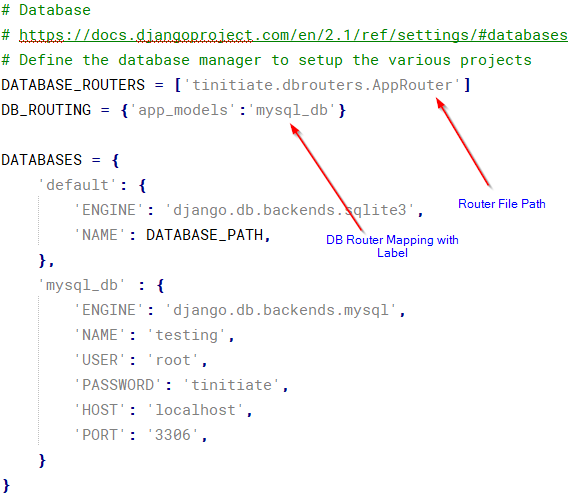

# Django Model
* A model in Django is an object that represents a data base table.
* It is a single, definitive source database table, that contains fields or 
  properties of the dataset that is stored.
* Almost usually each model maps to a single database table.


## Django Model - DB Data Type Mapping
* The colun datatypes that are supported by the 
* CharField(max_length) Used for String Data Types
* DecimalField(max_digits, decimal_places) Used for Decimal Data Types (100.20)
* IntegerField  Used for Integer Data Types	(1,2..)
* TextField Multi-line Strings
* DateField used for date data
* DateTimeField used for Date Time Data
* BooleanField True / False Data
* FileField Binary File Data

## Demonstration the DatabBase Tables as Model

## Django Model with MySQL Database
* Below example demonstrates the steps needed to create a **Django Model** 
  with MySQL database.

## PreReqs MySQL Setup
* Install the MYSQL CLIENT for Python, at the command prompt
  ,install using the `pip` command
```
pip install mysqlclient
```

### STEP 1. Create Django APP To Demonstrate Django Forms
* Navigate to the Project Folder `tinitiate` and in the path that has the 
  `manage.py` file.
* Create an **APP** named `app_models`
* Using the following command.
```
python manage.py startapp app_models
```

### STEP 2. Change App Settings for Project
* **PROJECTs settings.py**
  * Locate the **PROJECTs** `settings.py` file, In this case its located at
    `tinitiate/tinitiate/settings.py` file.
  * In the `settings.py` file add the app name **app_forms** to the 
    **INSTALLED_APPS**  list.
  * In the `settings.py` file add the template folder location of the 
    APP **app_forms** to the **TEMPLATES/DIRS** section of the file.
* **PROJECTs urls.py**
  * Locate the **PROJECTs** folder and in the `urls.py` file, And add the 
    App Name **app_models** with the following


## STEP 3. Configure the settings.py
* Add the database details in the `DATABASES` dictionary of the settings.py file
* Here we have TWO databases (MySQL and SQLite), See configuration 



## STEP 4. Create Database Tables in MYSQL
* Log on the MYSQL database and create the following tables in the `testing`
  database Here we create MySQL tables with a Primary Key Foreign Key relations
```
create database testing;
use testing;

create table emp (
     empid     integer
    ,ename     varchar(100)
    ,salary    decimal(10,2)
    ,join_date date
    ,address   text);

alter table emp add constraint pk_employee primary key (empid);
```


## STEP 5. Create the Database Router
* Since we have multiple databases configured to work with Django in the settings, 
  we need to Route the DB access as needed.
* Also add the router file details to the projects `settings.py` file

* Place in the location: `$HOMW/project/tinitiate/dbrouters.py`
```
from django.conf import settings

class AppRouter:

    def db_for_read(self, model, **hints):
        """
        Attempts to read user models go to mysql_db.
        """
        if model._meta.app_label == 'app_models':
            return 'mysql_db'
        return None

    def db_for_write(self, model, **hints):
        """
        Attempts to write user models go to mysql_db.
        """
        if model._meta.app_label == 'app_models':
            return 'mysql_db'
        return None

    def allow_relation(self, obj1, obj2, **hints):
        """
        Allow relations if a model in the user app is involved.
        """
        if obj1._meta.app_label == 'app_models' or \
           obj2._meta.app_label == 'app_models':
           return True
        return None

    def allow_migrate(self, db, app_label, model_name=None, **hints):
        """
        Make sure the auth app only appears in the 'mysql_db'
        database.
        """
        if app_label == 'app_models':
            return db == 'mysql_db'
        return None
```


## STEP 6. Inspect Database and generate Model Files 
* Using the inspectdb argument of the `manage.py` we can generate the 
  models.py file for each of the table.
* In this project we have multiple databases, and we have the tables in the 
  MYSQL database, alias with `mysql_db`
* Run the following commands at the command line,
```
python manage.py inspectdb --database=mysql_db emp > models.py
```
* The above commands will generate model file for table `emp`
* Copy the generated model files to this folder:
  * `/app_models/models`
  * We can create as many models as we want and append the new Model Class to the models.py


## STEP 7. The generated models.py file
* Add the DB Router info to the models.py, in the sub-class meta, as shown below
```
from django.db import models

class Emp(models.Model):
    empid = models.IntegerField(primary_key=True)
    ename = models.CharField(max_length=100, blank=True, null=True)
    salary = models.DecimalField(max_digits=10, decimal_places=2, blank=True, null=True)
    join_date = models.DateField(blank=True, null=True)
    address = models.TextField(blank=True, null=True)

    class Meta:
        app_label = 'app_models'
        db_table = 'emp'
```

### STEP 8. Edit the Projects urls.py file and App urls.py file
* **Add the APP details to the projects urls.py,**
* `path('app_django_html_templates/', include('app_django_html_templates.urls')),`
```
from django.contrib import admin
from django.urls import include, path

urlpatterns = [
    path('', include('app_home.urls')),
    path('app_urls/', include('app_urls.urls')),
    path('app_django_templates_inheritance/', include('app_django_templates_inheritance.urls')),
    path('app_django_html_templates/', include('app_django_html_templates.urls')),
    path('multiple_views/', include('app_multiple_view_files.urls')),
    path('app_views/', include('app_views.urls')),
    path('app_ti/', include('app_ti.urls')),
    path('app_models/', include('app_models.urls')),
    path('app_response_types/', include('app_response_types.urls')),
    path('app_forms/', include('app_forms.urls')),
    path('app_webservices/', include('app_webservices.urls')),
    path('app_cookies/', include('app_cookies.urls')),
    path('app_sessions/', include('app_sessions.urls')),
    path('app_management_commands/', include('app_management_commands.urls')),
    path('admin/', admin.site.urls),
]
```

* **Add APPs urls.py**
```
from django.conf.urls import include, url
from django.urls import path, re_path
from . import views

urlpatterns = [
    # For URL: localhost:8000/app_models/LoadEmpRecords
    path('LoadEmpRecords/', views.LoadEmpRecords, name='LoadEmpRecords'),

    # For URL: localhost:8000/app_models/GetRecordByID
    # Usage Example URL: localhost:8000/app_models/GetRecordByID/1
    path('GetRecordByID/<int:in_empid>', views.GetRecordByID, name='GetRecordByID'),

    # For URL: localhost:8000/app_models/GetAllRecords
    # Usage Example URL: localhost:8000/app_models/GetAllRecords/
    path('GetAllRecords/', views.GetAllRecords, name='GetAllRecords'),

    # For URL: http://localhost:8000/app_models/UpdateSalaryByEmpID/
    # Usage Example URL: http://localhost:8000/app_models/UpdateSalaryByEmpID/1/4444
    path('UpdateSalaryByEmpID/<int:in_empid>/<int:in_salary>', views.UpdateSalaryByEmpID, name='UpdateSalaryByEmpID'),

    # For URL: http://localhost:8000/app_models/DeleteRecordByEmpID/
    # Usage Example URL: http://localhost:8000/app_models/DeleteRecordByEmpID/1
    path('DeleteRecordByEmpID/<int:in_empid>', views.DeleteRecordByEmpID, name='DeleteRecordByEmpID'),

    # For URL: http://localhost:8000/app_models/DeleteAllRecords/
    # Usage Example URL: http://localhost:8000/app_models/DeleteAllRecords/
    path('DeleteAllRecords/', views.DeleteAllRecords, name='DeleteAllRecords'),
]
```

## STEP 9. The views.py file
* Create the `views.py` file
```
from django.shortcuts import render
from django.http import HttpResponse
# Import the Model from current APP
from .models import Emp
from datetime import datetime 

# Insert TWO rows into EMP table in MySQL database
def LoadEmpRecords(request):

    # Create Few Data Sets
    empRecord1 = Emp( empid     = 1
                     ,ename     = "AAA"
                     ,salary    = 1000.00 
                     ,join_date = datetime.now()
                     ,address   = "111 TEST AVE TEST_CITY")

    empRecord1.save()

    empRecord2 = Emp( empid     = 2
                     ,ename     = "BBB"
                     ,salary    = 2000.00 
                     ,join_date = datetime.now()
                     ,address   = "222 DEMO AVE DEMO_CITY")

    empRecord2.save()
    return HttpResponse('2 Rows Inserted')


# Get EMP record by emp_id
def GetRecordByID(request, in_empid):

    # Get Row Data by primary key
    rowObj = Emp.objects.get(pk=in_empid)

    data = str(rowObj.empid) + " " + str(rowObj.ename) + " "
    data = data + str(rowObj.salary) + " " + str(rowObj.join_date) + " "
    data = data + str(rowObj.address)

    return HttpResponse(data)


# Method to return all rows from the EMP table
def GetAllRecords(request):
    data = ""
    for e in Emp.objects.all():
        data = data + str(e.empid) + " " + str(e.ename) + " "
        data = data + str(e.salary) + " " + str(e.join_date) + " "
        data = data + str(e.address) + "<br>"

    if data == "":
        data = "No Records Found !"

    return HttpResponse(data)


# Function to Update Salary By EmpID
def UpdateSalaryByEmpID(request, in_empid, in_salary):

    rowObj = Emp.objects.get(pk=in_empid)
    rowObj.salary = in_salary
    rowObj.save()

    return HttpResponse("EmpID - " + str(in_empid) + " updated salary " + str(in_salary))


# Function to Delete Record By EmpID
def DeleteRecordByEmpID(request, in_empid):
    #Delete an entry
    rowObj = Emp.objects.get(pk=in_empid)
    rowObj.delete()
    
    return HttpResponse("EmpID - " + str(in_empid) + " updated salary " + str(in_salary))


# Function to Delete All Records
def DeleteAllRecords(request):
    data = ""
    for e in Emp.objects.all():
        data = data + str(e.empid) + "<br>"
        e.delete();

    return HttpResponse("EmpID Records deleted for " + "<br>" + data)

```


### STEP 10.Runserver and test Templates
* At commandline naviage to the projects manage.py file, and generate models
  using the command:
```
python manage.py runserver
```
* Open a browser to test the URLs defined so far
  * This inserts records `localhost:8000/app_models/LoadEmpRecords`
  * Get Record by EmpID `localhost:8000/app_models/GetRecordByID/1`
  * Get All `localhost:8000/app_models/GetAllRecords/`
  * Update Salary of EmpID `1` `http://localhost:8000/app_models/UpdateSalaryByEmpID/1/4444`
    * Test by running `localhost:8000/app_models/GetAllRecords/`
  * Delete one Emp record by ID: `http://localhost:8000/app_models/DeleteRecordByEmpID/1`
  * Delete all Emp records: `http://localhost:8000/app_models/DeleteAllRecords/`
    * Test by running `localhost:8000/app_models/GetAllRecords/`
```
