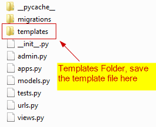
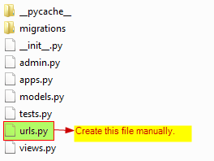

# Django Cookies
* Cookie or browser cookie is a file on the web browser user's computer, created
  by the website by the user's while the user is browsing.
* Cookies are used to store website session and stateful information such as 
  shopping cart items, record the user's browsing activity, storing HTML filled 
  in form data, names, addresses, passwords, and credit card numbers.
* Cookies are also used to store authentication details for the session of usage.


## STEP 1. Create Django APP To Demonstrate Views
* Navigate to the Project Folder `tinitiate` and in the path that has the 
  `manage.py` file.
* Create an **APP** named `app_cookies`
* Using the following command.
```
python manage.py startapp app_cookies
```
* The create a `templates` folder in the APP


## STEP 2. Project Folder settings.py changes
* Locate the **PROJECTs** `settings.py` file, In this case its located in the 
  `tinitiate/tinitiate/settings.py` file, Append the **APP app_cookies** name to the 
  list **INSTALLED_APPS**  we created in **STEP 1**


### STEP 3. Create HTML Template in the Template Folder
* Create a HTML Template File `simple-template.html` and save it in the folder 
  mentioned in the settings.py `TEMPLATES` dictionary `DIRS` element
* In this case use we are using the folder
  * `F:\\code\\tinitiate\\source\\python-django\\code\\tinitiate\\app_django_html_templates\\templates`
* Folder Structure for templates
* 
* Place the Template file `mycart.html` in the template folder of the APP
```
<html>
    <body>
        
            <h1>Cookie is Set Retriving Shopping Cart Values</h1>

            <p>User Name: {{ user_id }}</p>
            <br><br>

            <h2>Shopping Cart Details</h2>
            
                <p>{{ choice }}</p>
            
        
            <h1>Cookie is Not Set</h1>
        
    </body>

</html>
```
* Place the Template file `shopping.html` in the template folder of the APP
```
<form method="post" action="">

    

    <b>User name:</b><br>
    {{form.userid.as_text}}<br><br>
    <hr>
    <b>Checkbox:</b><br>
    {{form.CheckBox}}<br><br><br>

    <button type="submit">Submit</button>
</form>
```

## STEP 4. Projects folder urls.py Configuration
* Create an new file `urls.py` in the APP folder
* 
* Add the following code
```
urlpatterns = [
    path('', include('app_home.urls')),
    path('app_urls/', include('app_urls.urls')),
    path('app_django_templates_inheritance/', include('app_django_templates_inheritance.urls')),
    path('app_django_html_templates/', include('app_django_html_templates.urls')),
    path('multiple_views/', include('app_multiple_view_files.urls')),
    path('app_views/', include('app_views.urls')),
    path('app_ti/', include('app_ti.urls')),
    path('app_response_types/', include('app_response_types.urls')),
    path('app_forms/', include('app_forms.urls')),
    path('app_webservices/', include('app_webservices.urls')),
    path('app_cookies/', include('app_cookies.urls')),
    path('admin/', admin.site.urls),
]
```

## STEP 5. Create the forms.py file
* Here we use forms to demonstrate user input and save the input to a cookie.
* Create the following in the `forms.py` of the APP folder
```
from django import forms

class TestForm(forms.Form):
    # HTMl INPUT Box
    userid = forms.CharField()

    form_choices = (
        (1, 'Food'),
        (2, 'Drinks'),
        (3, 'Cleaning Supplies'),
        (4, 'Body Care'),
        (5, 'House Ware'),
        (6, 'Electronics')
    )

    # HTML Check Box
    CheckBox = forms.MultipleChoiceField(choices=form_choices, widget=forms.CheckboxSelectMultiple)
```

## STEP 6. Add content to the views.py file
* The `views.py` demonstrates the following
  * Create or Set Cookies
  * View the Set Cookies  
  * Delete Cookies
* Here we use the templates to accept user input and another template to 
  display the selected user input and also show data from the cookies.
```
from .forms import TestForm
from django.template import Template, Context, loader
from django.shortcuts import render, redirect
from django.http import HttpResponse

# View the Current Cart (get details from Cookie)
def cookie_view(request):

    # Create Template Object
    template = loader.get_template('mycart.html')

    # Check if Cookie exists, Check in the Dictionary "request.COOKIES"
    print(request.COOKIES.get('user_id'))

    if 'user_id' in request.COOKIES:

        # Set Cookies    
        userid_txt = str(request.COOKIES['user_id'])
        cd_list = list(request.COOKIES['CheckBox_Selected'])

        # Data (context) to be passed to template
        context = {
            'user_id': userid_txt,
            'CheckBox_Selected' : cd_list,
            'cookie_status' : 1
        }
    else:
        context = {
            'cookie_status' : 0
        }

    return HttpResponse(template.render(context, request))


# Accept Inputs and Set Cookie
def cookie_set(request):

    if request.method == 'POST':

        # Create Template Object
        template = loader.get_template('mycart.html')

        # Create a New Global Response Object
        response = HttpResponse('test')

        testForm = TestForm(request.POST)

        if testForm.is_valid():

            # Get Shopping Cart Details
            checkbox_data_list = testForm.cleaned_data['CheckBox']

            # Check Box Selected Choice    
            cd_list = []
            for i in checkbox_data_list:
                cd_list.append(TestForm.form_choices[int(i)-1][1])

            # UserID and Password Text Box values
            userid_txt = testForm['userid'].value()

            # Data (context) to be passed to template
            context = {
                'user_id': userid_txt,
                'CheckBox_Selected' : cd_list,
                'cookie_status' : 1
            }

            response = HttpResponse(template.render(context, request))

        # Set Cookies
        # ===========
        response.set_cookie('user_id', userid_txt,max_age=100)
        response.set_cookie('CheckBox_Selected', cd_list,max_age=100)

        return response

    else:
        form = TestForm()
        return render(request,'shopping.html',{'form':form})


# Delete Cookies
def cookie_delete(request):

    # Create Response Object from the Root View Function
    response = redirect('app_cookies.views.cookie_set')
    response.delete_cookie('user_id')
    response.delete_cookie('CheckBox_Selected')

    return HttpResponse('Cookies Deleted')
```

## STEP 7. APP folder urls.py Configuration
* Create an new file `urls.py` in the APP folder
* 
* Add the following code
```
from django.urls import path
from . import views

urlpatterns = [
    path('cookie_set/', views.cookie_set, name='cookie_set'),
    path('cookie_view/', views.cookie_view, name='cookie_view'),
    path('cookie_delete/', views.cookie_delete, name='cookie_delete'),
]
```

## STEP 8. Run Project and Test URLS in Browser
* At commandline start the project, using the command:
```
python manage.py runserver
```
* Open a browser to set the cookie, Do this by entering data and selecting 
  values in the check box.
* Set Cookies using:  `http://localhost:8000/app_cookies/cookie_set`
* View Cookies using: `http://localhost:8000/app_cookies/cookie_view`
* Delete Cookies using: `http://localhost:8000/app_cookies/cookie_delete`
* Test to make sure cookies are deleted using
* View Cookies using: `http://localhost:8000/app_cookies/cookie_view`
